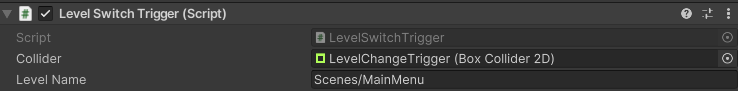
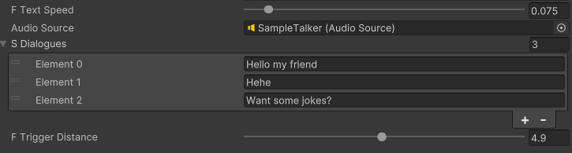
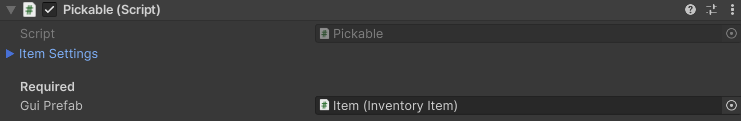
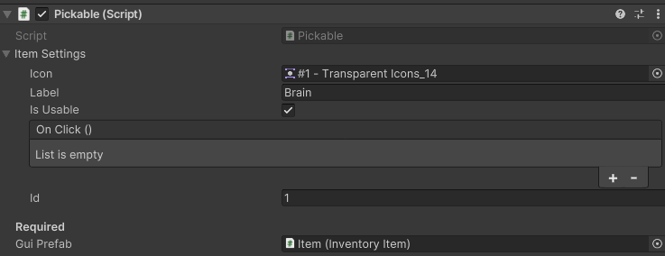
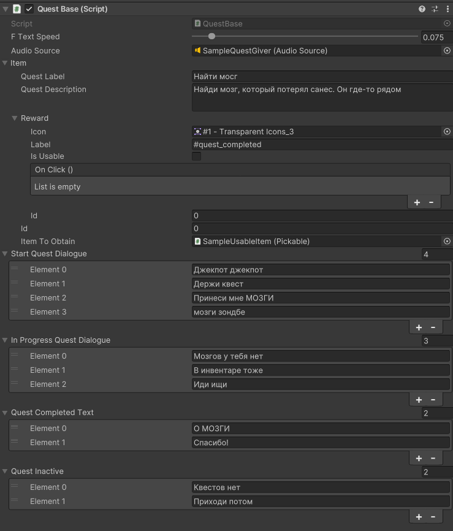

# Общие положения

> **Читайте README**
>
>Общая информация показана в [README](../README.md)-файле. Более подробные положения, касающиеся создания NPC, квест-файлов, внутриигровых настроек и прочего представлены тут.

# Примеры реализаций

Все примеры реализованных объектов можно найти в папке **Assets/Prefabs/SAMPLES**

# Создание внутриигровых сцен

На данный момент определен шаблон игровых уровней, содержащий начальную необходимую логику.
Создать уровень из шаблона можно в меню Unity *File->New Scene->Game Level*
После загрузки уровня рекомендуется сохранить его в директорию *Scenes/ChapterX* где X - номер главы, к которой относится игровой уровень

> В случае несоответствия шаблона с текущими требованиями к структуре уровня необходимо открыть Issue на GitHub.

# Навигация персонажей

Враги используют алгоритм поиска А* для навигации по игровому уровню. Картой препятствий выступает объект *Grid/Walls* на игровой сцене.
При добавлении префаба/варианта противника назначение этой опции не требуется - скрипт получает этот объект **по имени** самостоятельно.

> В случае **отсутствия** объекта **Grid/Walls** или несоответствия его имени в консоли будет отображена ошибка, а логика противников критически нарушена.
>
> В связи с этим **настоятельно рекомендуется** создавать уровни из шаблона

Навигационный код реализуется в классе *EnemyBase*, который по умолчанию встроен в классы логики противников. Дополнительных действий не требуется

# Логика триггер-зон

На текущий момент есть четыре типа триггерных зон:
- Базовый тип Trigger. **Абстрактный, не может быть реализован**
- DialogueTrigger. Запускает диалог при появлении игрока в зоне Collider
- LevelSwitchTrigger. Запускает смену уровня при появлении игрока в зоне Collider
- ScriptableTrigegr. Позволяет назначить activation и deactivation события из стороннего C# класса

Все типы наследуются от Trigger. Для создания префаба необходим назначенный Collider2D со включенной опцией isTrigger

# Смена уровней
Подход к смене уровней упрощен, состояние сцен пока не сохраняется.
Для создания зоны перехода нужно определить объект LevelSwitchTrigger

*Настройки LevelSwitchTrigger*

- Collider - объект-коллайдер **в режиме trigger**
- LevelName - название сцены, путь к ней относительно Assets

> LevelName - название сцены для перехода. Однако, если сцена не находится в Build Settings проекта **ПЕРЕХОД ОСУЩЕСТВЛЕН НЕ БУДЕТ**. 
> Следите за актуальностью сцен в настройках проекта

# Логика диалоговых объектов

Диалоговыми объектами могут быть как Trigger-ы, так и NPC с назначенным скриптом *DialogueController*.
> Для корректной работы диалоговых объектов необходим реализованный объект **MasterDialogueController** и 
> префаб GUI на сцене. 
> 
> В связи с этим **настоятельно рекомендуется** создавать уровни из шаблона

*Пример настройки диалогового объекта*

### Основные настройки Dialogue

Основные настройки диалогов:
- TextSpeed - задержка в секундах между выводимыми символами
- AudioSource - Объект AudioSource с назначенным звуком "голоса". Звук проигрывается при выводе одного символа
- Dialogues - массив строк. Вывод построчный с ожиданием пользовательского действия между элементами
- Trigger Distance - **ПАРАМЕТР УСТАРЕЛ**
- Для DialogueTrigger существует параметр destroyAfter - удаление триггера после полного прочтения его диалога
> На удаление TrigegrDistance будет открыт Issue. Эти строки в документации также будут убраны

# Описание и создание предметов

Описание файлов происходит в два этапа - создание Pickable и добавление настройки Item. GUI-элемент инвентаря заполняется в полном соответствии со структурой Item и не требует отдельной настройки

## Как создать Pickable?

Класс **Pickable** предоставляет базовую логику подбираемого предмета. 

### Создание Pickable стандартной логики

Необходимо передать лишь GuiPrefab - префаб элемента интерфейса *Prefabs/GUI/Item*

### Создание Pickable кастомной логики
Отнаследуйте Pickable, определите свои методы. Возможно назначение метода Update без последствий для основной логики.

Создайте префаб, выполняя требования в т.ч. прошлого пункта.

> Возможно изменение логики и этой статьи вместе с ней

## Как создать Item?

Item.cs не является MonoBehaviour. Это значит, что невозможно создать самостоятельный объект Item, 
однако сейчас Item является частью Pickable и соответственно может быть настроен при создании экземпляра подбираемого предмета

Настройки Item:
- Icon - спрайт-иконка для отображения на интерфейсе
- Label - Название предмета
- isUsable - определяет наличие кнопки Use Item
- OnClick() - назначение методов кастомного поведения Item при использовании

> Существует проблема, что Item и InventoryManager впринципе не связаны со сценой, так как InventoryManager является DoNotDestroyOnLoad. 
> Не слвсем ясно, как конкретно можно реализовать функцию OnClick() и гарантировать ее вызов при текущей архитектуре
> **однако**
> 
> Скорее всего класс Pickable станет шаблонным абстрактным классом, что позволит определить кастомный тип Item, содержащий реализации OnClick()-функций, и, соответственно, определение кастомного Pickable

> Эта глава будет изменена

# Логика квестов

На данный момент полностью рабочей реализацией квеста является **QuestItemObtainItem** - квест на получение какого-либо подбираемого интерфейса.
Настройки данного квеста представлены ниже:

- Text Speed - задержка в секундах между выводимыми символами
- AudioSource - Объект AudioSource с назначенным звуком "голоса". Звук проигрывается при выводе одного символа
- Item - Настройки отображаемого квеста
- - Quest Label - название квеста
- - Quest Description - описание квеста (многострочное)
- - Reward - награда за выполнение - см. **Описание и создание предметов**
- - - id - идентификатор предмета (уникальный или соответствующий существующему файлу)
- - id - идентификатор квеста (уникальный)
- - Item to Obtain - Pickable-предмет, необходимый для выполнения квеста
- Start Quest Dialogue - диалог начала квеста (квест не был получен и выполнен до этого)
- In Progress Quest Dialogue - квест в стадии выполнения (не выполнено условие завершения)
- Quest Completed Text - квест выполнен, происходит первое взаимодействие с NPC
- Quest Inactive - квест выполнен, последующие взаимодействия с NPC

> Мне не нравится, что сейчас Reward Item не может быть задан существующим предметом (вернее, может, однако нужно выполнить полное соответствие настроек у квеста и у предмета).
> Этот момент может измениться вместе с этой главой

> Мне не нравится, что obtainQuest можно выполнить только при помощи PickableItem, когда логичнее это делать при помощи Item - элемента инвентаря.
> **На эти два момента скорее всего уже заведен Issue**
---

**Author:** KeyboardDestroyer